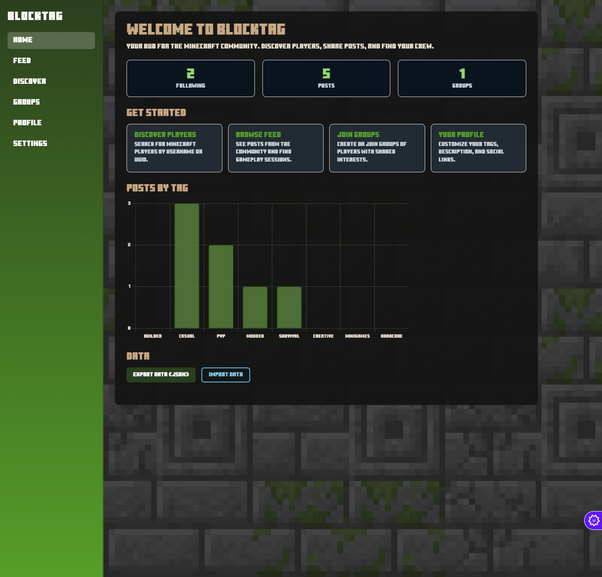
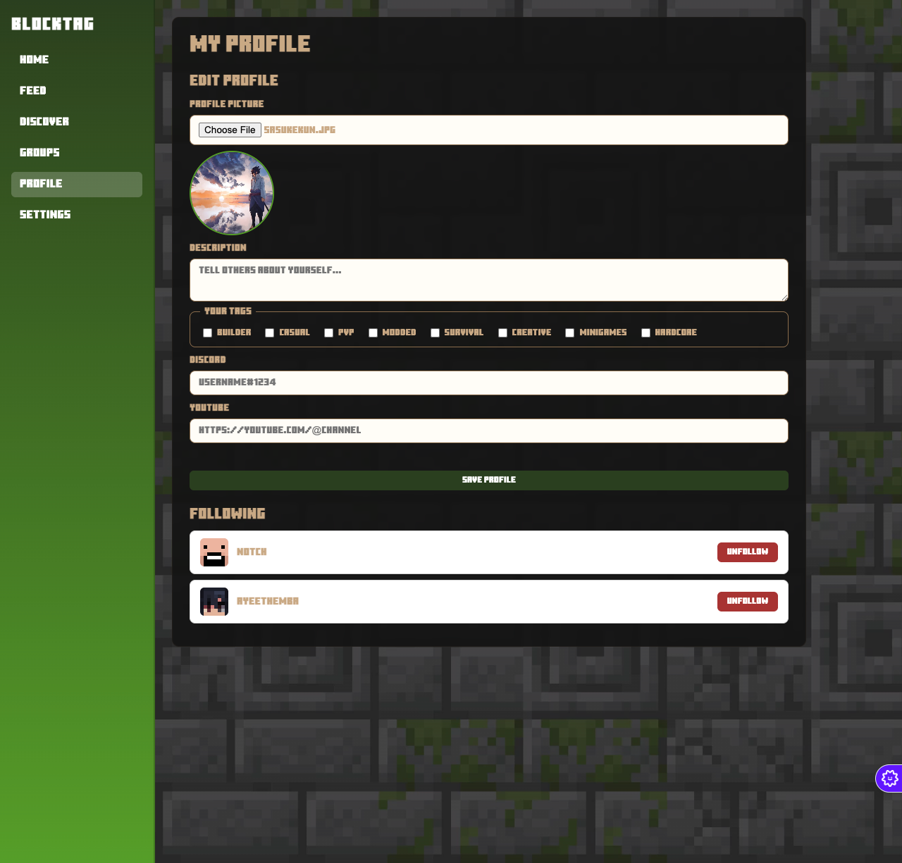

# BlockTag — Social Platform for Minecraft Players

**[▶ Try it in your browser](https://ayeethemba.github.io/blocktag/)**

A client-side social platform where Minecraft players build profiles, post to a
tag-ranked feed, and find each other by playstyle. Built with vanilla JavaScript
for CS 343 (Web Development) at James Madison University, Spring 2026.

<!-- TODO: 1-2 screenshots (discover page + tag-filtered feed), e.g. docs/images/screenshot-feed.png -->




## About

Search for any real Minecraft player by username, UUID (dashed or undashed), or any
URL containing a UUID (like a Crafatar avatar link). BlockTag resolves the player
through the Mojang API and renders their live skin. Build your own profile with
playstyle tags (builder, casual, PvP, modded), post to recruit players for
multiplayer sessions, and create groups whose member posts get feed priority.

The feed is ordered by a mix of tag relevance and recency, so you see posts from
players who play the way you do.

## Features

- **Player search** via the Mojang API: username, UUID, or UUID-bearing URLs, with live skin rendering
- **Profiles** with descriptions, playstyle tags, and Discord/YouTube links
- **Posts** with tags and an "interested players" sign-up list for organizing multiplayer sessions
- **Groups** that act as friend lists and boost member posts in the feed
- **Tag-ranked feed** sorted by preference match and recency
- **Dark mode** and print-friendly layouts
- **Accessibility first**: screen-reader-compatible profiles and post descriptions throughout

## Architecture

No backend: the app is fully client-side, deployed on GitHub Pages from `docs/`.

- **Persistence** runs through a single `Store` module (`docs/js/storage.js`) wrapping
  localStorage, so every page does CRUD against one API: following, profile, posts,
  groups, and settings
- **Mojang integration** (`docs/js/discover.js`) routes requests through CORS proxies
  with fallback, since Mojang's API sends no CORS headers, and normalizes the three
  supported input formats down to a UUID before fetching
- **Four data models** (from the [design doc](documents/DESIGN.md)): PlayerProfile
  (read-only, API-sourced), MyProfile, Post, and Group

## My Contributions (Co-Lead Developer)

Co-led development with Layla Aure; the two of us drove the bulk of the build, with the
rest of the team contributing more heavily toward the final stretch.

- Built core pages and the localStorage persistence layer (`Store` module) powering CRUD for the full MVP
- Implemented the Mojang API integration, including live player-skin loading through CORS proxy fallback
- Set up GitHub Pages deployment and the `docs/` build structure
- Ran accessibility passes: screen-reader compatibility and a11y checks across pages
- Contributed to the project design documents (data models, annotated design sketch)

## Tech Stack

Vanilla JavaScript · HTML5/CSS3 · localStorage · Mojang REST API · GitHub Pages

## How to Run

Use the [live site](https://ayeethemba.github.io/blocktag/), or locally:

```bash
git clone https://github.com/ayeethemba/blocktag.git
```

Open `docs/index.html` in your browser. No dependencies, no build step.

## Team — Duke Dawgs

- **Themba Chika** — co-lead developer: core pages, persistence layer, deployment, a11y
- **Layla Aure** — co-lead developer: Mojang integration, scrum master
- **Logan Kasmier** — acccesibility
- **Christopher Sledd** — presentation

## Docs

- [Original design document](documents/DESIGN.md): purpose, users, data models
- [Annotated design sketch](documents/BlockTag_Design_Sketch.pdf)
